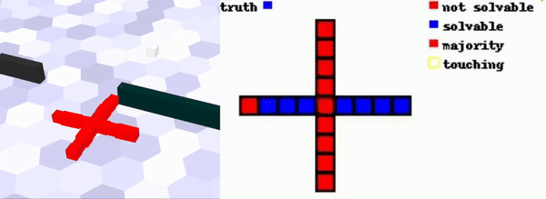

# Morphology Choice Affects the Evolution of Affordance Detection in Robots
This is the official repository for the *GECCO'23* paper

**<a href="https://github.com/pigozzif/pigozzif.github.io/blob/master/documents/2023_GECCO_VSREvolvedAffordance.pdf">Morphology Choice Affects the Evolution of Affordance Detection in Robots</a>**
<br>
<a href="https://pigozzif.github.io">Federico Pigozzi</a>
<br>

Hosting all the code for replication. More videos are available at this [link](https://affordancesoftrobots.github.io/affordancesoftrobots/).

<div align="center">
</img>
</div>

## Bibliography
Please cite as:
```
@inproceedings{pigozzi2023morphology,
  title={Morphology Choice Affects the Evolution of Affordance Detection in Robots},
  author={Pigozzi, Federico and Woodman, Stephanie and Medvet, Eric and Kramer-Bottiglio, Rebecca and Bongard, Josh},
  booktitle={Proceedings of the Genetic and Evolutionary Computation Conference},
  pages={211--219},
  year={2023}
}
```
